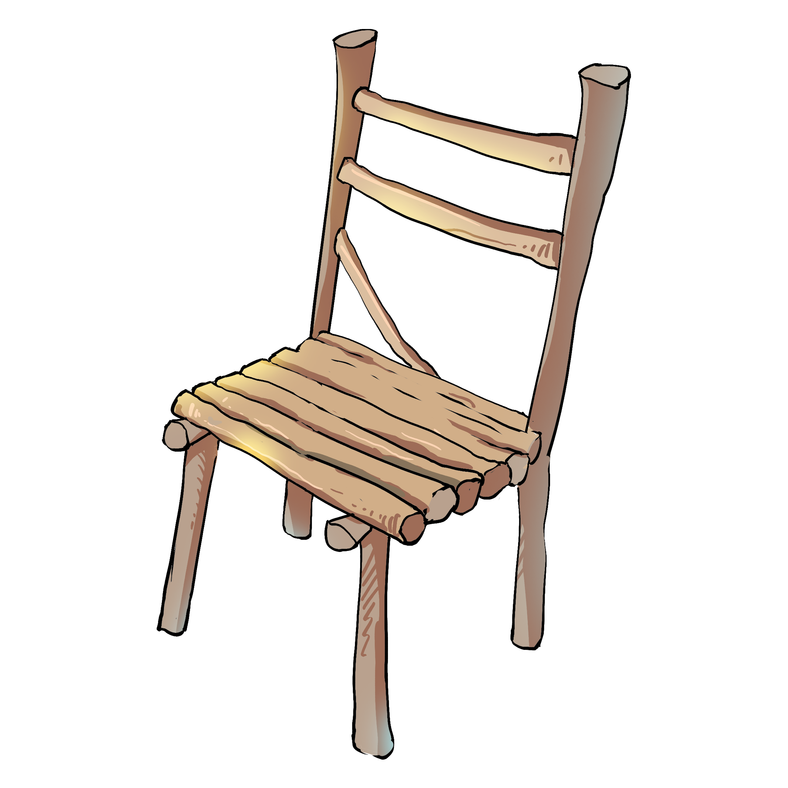

# My Anticlimax Fireworkshow

Welcome to the beginning of the proces of making my anticlimax firework show. I'll take you to the steps I took and where I went wrong.

## Week 1

I started this journey with a different plan. Have you seen Kung Fu Panda? In the first movie he tries to get over a wall using fireworks and a chair. I wanted to recreate this.

It started with the basics. Using images for the panda.

`
<label for="">
    
    
</label>
`
`
img:first-child {
	position: absolute;
	top: 5vh;
	left: 7vw;
	z-index: 1;
}

img:last-child {
	position: absolute;
	top: 8vh;
	left: 3vw;
	width: 280px;
	transform: scaleX(-1);
}
`

Next I had my first challange: Making a first interactive firework arrow. The only way I could make it interactive was using a `<label>` element. With the `<label>` I made a firework arrow using three `<figures>`. One for the tip, one for the body and one for the stick.

`
label {
	position: absolute;
	transform: scale(0.3);
	z-index: 5;
	height: 350px;
	width: 120px;
	filter: drop-shadow(2px 2px 4px rgb(0,0,0,0.5));
	transition: 1s;
	cursor: pointer;
	animation: 1s
}

label > figure:first-child {
	clip-path: polygon(50% 0%, 0% 100%, 100% 100%);
	border-radius: 50%;
	position: absolute;
	left: calc(50% - 55px);
	width: 110px;
	height: 130px;
	z-index: 3;
	background-image:	
		conic-gradient(
		at center top,
		transparent 146deg,
		darkgray 146deg,
		lightgray 170deg,
		darkgray 214deg,
		transparent 214deg
	);
	clip-path:ellipse(90% 70% at center top);
}

label figure:nth-child(2) {
	background: blue;
	position: absolute;
	top: 83px;
	left: calc(50% - 37.5px);
	width: 75px;
	height: 160px;
	z-index: 2;
	background-image:
		linear-gradient(
			to right,
			#303a 0%,
			transparent 65%,
			#3036 100%
		),
		repeating-radial-gradient(
			red 0 1em,
			blue 1em 2em
		);
	background-size: 100% 100%, 600% 600%;
	background-position:left top, 40% -30%;
	border-radius: 0 0 50% 50% / 0 0 1em 1em;
}

label > figure:nth-child(3) {
	position: absolute;
	background: #BA8C63;
	top: 220px;
	left: calc(50% - 37.5px);
	width: 10px;
	height: 110px;
	z-index: 1;
	box-shadow: inset -2px 0 8px rgb(0,0,0,0.5);
	clip-path: ellipse(10px 95px at 50% 10%);
}
`

